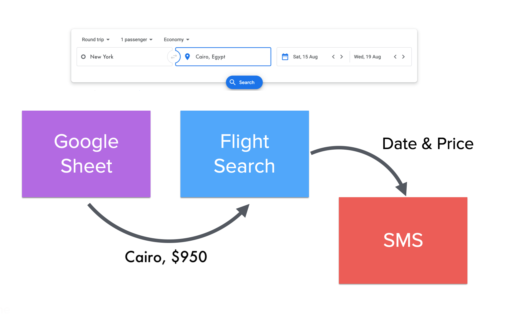

Google sheet to keep track of the locations we want to visit and a "price cut-off" (a historical low price) for each location,
then we feed these data from google sheet to flight search API looking for the cheapest flight over the next months or so.
When it finds a flight that cheaper than the cut-off price; it will send the price to a pre-defined phone as SMS via Twilio API.

