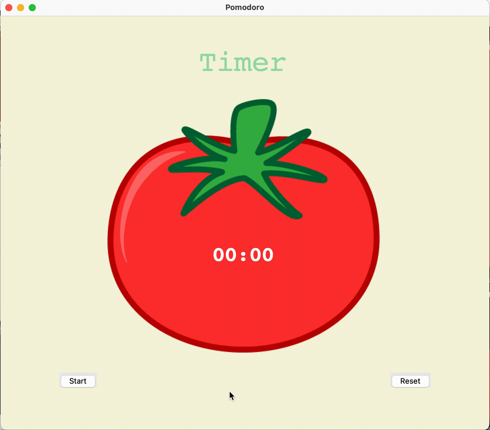

A simple timer GUI that uses Pomodoro technique to track your Work/Break time

Timer with a tomato on it :) when you click Start it will tell you to Work for 25 minutes,
then the window will go to the background and while you doing your "work" when the time goes up it will pop-up in above all of your windows and tell you to take a break !

First break is for 5 minutes, and it's gonna give you one Check meaning that one loop is finished .. it's gonna repeat like that until you complete your work or you click Reset

The pattern is like this :

    -   25 min. Work then 5 min. Break 
    -   25 min. Work then 5 min. Break
    -   25 min. Work then 5 min. Break
    -   25 min. Work then 20 min. Break
